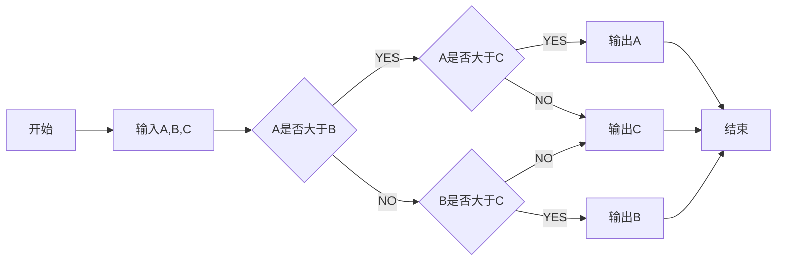
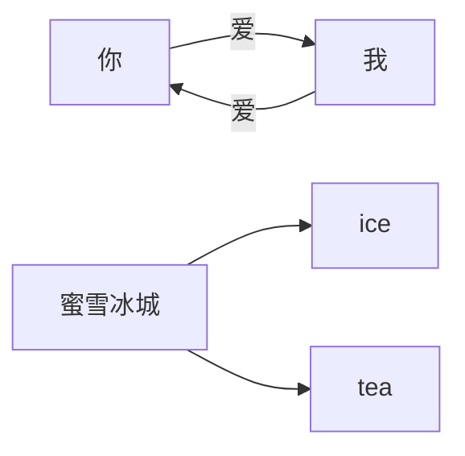
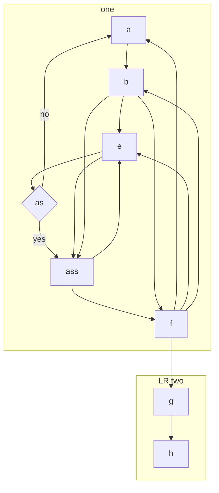

# actionRPG

## URPGItem::UPrimaryDataAsset

所有物品的基类 不可直接派生蓝图类

抽象 ， 蓝图类型

### 属性

- 价格    int32
- 最大容量    int32
- 能力等级    int32
- 物品种类    FPrimaryAssetType
- 名称            FText
- 描述            FText
- 被赋予的能力  Subclass<URPGGameplayAbility>
- 图标Icon          FSlateBrush

### 方法

- bool 是否为可消耗品 const
- FString 获取身份字符 const

| asdsd | sdasd | asdas |
| ----- | ----- | ----- |
| xxx   | ddd   | aaa   |
| xxx   | ddd   | ddd   |
| sss   | as    | ss    |

